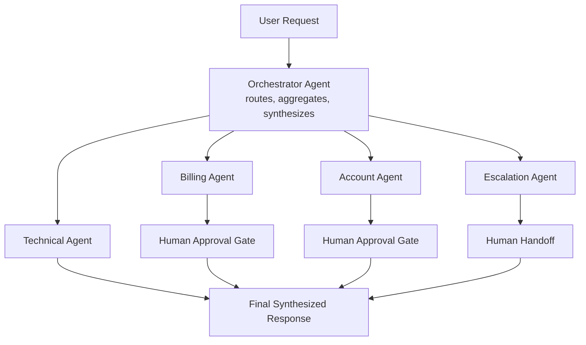

# Multi-Agent Customer Support System

A production-style multi-agent AI application built with **LangGraph** and **LangChain**, orchestrating specialist agents behind a single supervisor to handle customer support requests — with human-in-the-loop approval for sensitive actions, full observability, and an automated evaluation suite.

This project is built as a learning exercise, but follows real production engineering practices: structured routing, guardrails, evals, tracing, checkpointed state, and CI-integrated testing — not just a prompt-chaining demo.

---

## Overview

The system uses a **supervisor pattern**: an orchestrator agent classifies each user request, routes it to one or more specialist agents, and synthesizes their outputs into a single coherent response. Specialist agents never reply to the user directly — they report structured output back to the orchestrator, which keeps guardrails, tone, and multi-intent handling centralized in one place.

Sensitive actions (refunds above a threshold, account changes, closures) pause execution and wait for human approval before continuing, using LangGraph's native interrupt/resume mechanism — not a synchronous blocking call, but a durable, checkpointed pause that can resume minutes or hours later.

---

## Architecture



**Flow:**
1. The orchestrator classifies intent (single or multi-intent) and routes to the relevant specialist agent(s), fanning out in parallel when a query spans multiple domains.
2. Each specialist agent runs its tools (mocked backends for this project) and returns a structured output — never a direct reply to the user.
3. Billing and account agents route proposed sensitive actions through a **human approval gate** — the graph pauses via `interrupt()`, state is checkpointed, and the user gets an interim response while the action awaits review.
4. The escalation agent hands off to a human queue directly when automation isn't appropriate (low routing confidence, out-of-scope requests).
5. The orchestrator synthesizes all agent outputs — plus any approval outcomes — into one final response, after guardrail checks (PII, tone, policy compliance).

---

## Key features

- **Supervisor architecture** — centralized routing, synthesis, and guardrails instead of agents replying independently
- **Multi-intent handling** — parallel fan-out to multiple agents via LangGraph's `Send` API when a query needs more than one specialist
- **Human-in-the-loop** — LangGraph `interrupt()`/resume for sensitive billing and account actions, with risk-tiered approval thresholds
- **Durable state** — checkpointed graph execution (Postgres/SQLite) so approvals can resume after an indefinite pause
- **Guardrails** — PII redaction, topic-boundary checks, and response consistency checks before anything reaches the user
- **Evaluation suite** — labeled test sets for intent classification accuracy, routing correctness, and response quality, run automatically in CI
- **Observability** — full LangSmith tracing across every node, plus structured logging and cost/latency tracking
- **Fallback logic** — low-confidence classification defaults to human escalation rather than a risky automated guess

---

## Tech stack

| Layer | Tool |
|---|---|
| Orchestration | LangGraph |
| Agent/tool framework | LangChain |
| LLM | Claude (Anthropic API) |
| Observability & tracing | LangSmith |
| Evaluations | LangSmith Evaluations / custom harness |
| API layer | FastAPI |
| State persistence | LangGraph checkpointer (SQLite dev / Postgres prod) |
| Mocked data | SQLite seed data (billing/account records) |
| Testing | pytest |
| Deployment | Docker |
| CI/CD | GitHub Actions (tests + evals on every PR) |

---

## Project structure

```
.
├── app/
│   ├── db/
│   │   ├── connection.py        DB pool
│   │   └── billing_tools.py     Billing queries
│   ├── graph/
│   │   ├── state.py             Graph state
│   │   ├── orchestrator.py      Routing + synthesis
│   │   ├── agents/
│   │   │   ├── billing.py       Next step
│   │   │   ├── technical.py     Not started
│   │   │   ├── account.py       Not started
│   │   │   └── escalation.py    Not started
│   │   └── graph.py             Graph assembly
│   ├── tools/                   Non-billing tools
│   ├── guardrails/              Not started
│   └── api/
│       ├── main.py              FastAPI app
│       └── review.py            Approval endpoints
├── evals/
│   ├── datasets/                25 scenarios
│   └── run_evals.py             Not started
├── tests/                       Not started
├── data/
│   ├── schema.sql                Not uploaded
│   ├── seed_data.sql             Not uploaded
│   ├── seed_data_bulk.sql        Not uploaded
│   ├── fix_gaps_step1_enum.sql   Not uploaded
│   └── fix_gaps_step2_data.sql   Not uploaded
├── docker/                       Not started
├── .github/workflows/            Not started
├── requirements.txt               Not frozen yet
└── README.md                      Exists
```

---

## Getting started

```bash
# clone and install
git clone <repo-url>
cd multi-agent-support
pip install -r requirements.txt

# environment variables
cp .env.example .env
# set ANTHROPIC_API_KEY, LANGSMITH_API_KEY, DATABASE_URL

# run the API
uvicorn app.api.main:app --reload
```

Requirements: Python 3.11+, an Anthropic API key, and (optional but recommended) a LangSmith account for tracing.

---

## Human-in-the-loop workflow

1. A specialist agent proposes a sensitive action (e.g. a refund) and calls `interrupt()`.
2. The graph pauses; state is checkpointed against a `thread_id`.
3. The user receives an interim response ("submitted for review").
4. A reviewer hits `GET /review/pending` to see queued approvals, and `POST /review/{id}/decision` to approve or reject.
5. The graph resumes from the checkpoint with the reviewer's decision, and the specialist agent proceeds or reports rejection back to the orchestrator.

Risk-tiered thresholds (`low` / `medium` / `high`) determine what auto-approves versus what queues for review — see `design-doc.md` for the full policy table.

---

## Evaluation & monitoring

- **Evals** run against labeled datasets for: intent classification accuracy, routing correctness, response faithfulness/groundedness, and approval-gate trigger accuracy. Run locally via `evals/run_evals.py`, and automatically in CI on every pull request.
- **Monitoring** via LangSmith traces every node execution, tool call, token count, and latency. Structured JSON logs capture cost per conversation and error rates for dashboarding.

---

## Roadmap

- [x] Architecture & design doc
- [ ] Repo scaffolding
- [ ] Specialist agents (mocked tools)
- [ ] Orchestrator routing & synthesis
- [ ] Guardrails
- [ ] Evaluation suite
- [ ] Observability (LangSmith + logging)
- [ ] Dockerization & CI/CD
- [ ] Load testing & hardening

---

## License

MIT — this belongs to team MFDM