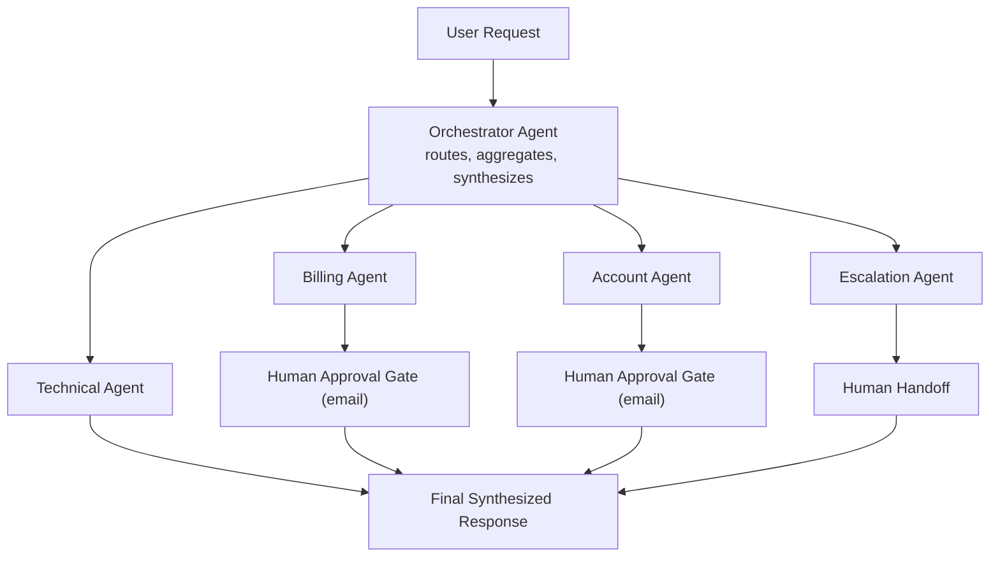

# Multi-Agent Customer Support System

A production-style multi-agent AI application built with **LangGraph** and **LangChain**, orchestrating specialist agents behind a single supervisor to handle customer support requests — with human-in-the-loop approval for sensitive actions, full observability, and an automated evaluation suite.

This project is built as a learning exercise, but follows real production engineering practices: structured routing, guardrails, evals, tracing, checkpointed state, and CI-integrated testing — not just a prompt-chaining demo.

---

## Overview

The system uses a **supervisor pattern**: an orchestrator agent classifies each user request, routes it to one or more specialist agents, and synthesizes their outputs into a single coherent response. Specialist agents never reply to the user directly — they report structured output back to the orchestrator, which keeps guardrails, tone, and multi-intent handling centralized in one place.

Sensitive actions (refunds above a threshold, account changes, closures) pause execution and wait for human approval before continuing, using LangGraph's native interrupt/resume mechanism — a durable, checkpointed pause that can resume minutes or hours later. The approval request and decision travel over **email** (Gmail API), not a web dashboard — see the Human-in-the-loop section below for why and how.

---

## Architecture


```mermaid
flowchart TD
    U["User Request"] --> O["Orchestrator Agent<br/>routes, aggregates, synthesizes"]

    O --> B["Billing Agent"]
    O --> T["Technical Agent"]
    O --> A["Account Agent"]
    O --> E["Escalation Agent"]

    B --> BG["Human Approval Gate (email)"]
    A --> AG["Human Approval Gate (email)"]
    E --> EH["Human Handoff"]
    T --> R["Final Synthesized Response"]

    BG --> R
    AG --> R
    EH --> R
```

**Flow:**
1. The orchestrator classifies intent (single or multi-intent) and routes to the relevant specialist agent(s), fanning out in parallel via LangGraph's `Send()` API when a query spans multiple domains.
2. Each specialist agent runs its tools and returns a structured output — never a direct reply to the user.
3. Billing and account agents route proposed sensitive actions through a **human approval gate**: the graph pauses via `interrupt()`, state is checkpointed, an approval-request email goes out, and the user gets an interim response while the action awaits review.
4. A human reviewer replies to that email with `APPROVE` or `REJECT`. A background poller (Gmail API) picks up the reply, correlates it back to the paused thread via email `Message-ID` headers, and resumes the graph automatically.
5. The escalation agent hands off to a human queue directly when automation isn't appropriate (low routing confidence, angry sentiment, out-of-scope requests, or an upstream agent's own error fallback).
6. The orchestrator synthesizes all agent outputs — plus any approval outcomes — into one final response, after guardrail checks (PII, tone, policy compliance).

---

## Key features

- **Supervisor architecture** — centralized routing, synthesis, and guardrails instead of agents replying independently
- **Multi-intent handling** — parallel fan-out to multiple agents via LangGraph's `Send()` API when a query needs more than one specialist (mechanism proven via `scripts/fan_out_spike.py` before any real agent depended on it)
- **Human-in-the-loop over email** — LangGraph `interrupt()`/resume for sensitive billing and account actions, with the approval/rejection decision captured from a real email reply rather than a web UI (see below)
- **Durable state** — checkpointed graph execution (Postgres) so approvals can resume after an indefinite pause
- **Permanent audit trail** — every approval request and its resolution is recorded in `approval_log`, independent of whether the underlying LangGraph checkpoint still exists
- **Guardrails** — PII redaction, topic-boundary checks, and response consistency checks before anything reaches the user (planned, not yet built)
- **Evaluation suite** — labeled test sets for intent classification accuracy and routing correctness (harness built, classifier itself not yet implemented — see Roadmap)
- **Fallback logic** — low-confidence classification and angry sentiment both route to human escalation rather than a risky automated guess (logic specced in `tests/test_routing_logic.py`, not yet implemented)

---

## Tech stack

| Layer | Tool |
|---|---|
| Orchestration | LangGraph |
| Agent/tool framework | LangChain |
| LLM | Google Gemini API (Gemini-only by deliberate decision — see `app/graph/llm.py`) |
| Human approval channel | Gmail API (OAuth2) — see "Human-in-the-loop" below |
| State persistence | LangGraph checkpointer (Postgres, `AsyncPostgresSaver`) |
| Database | Postgres (`asyncpg`) — mocked business data, real schema and queries |
| API layer | FastAPI (planned, not yet built) |
| Testing | pytest |
| Deployment | Docker (planned) |
| CI/CD | GitHub Actions (planned) |

---

## Project structure

```
.
├── app/
│   ├── db/
│   │   ├── connection.py        DB pool — registers a jsonb codec (asyncpg doesn't do this by default)
│   │   ├── billing_tools.py     Billing queries — Done
│   │   ├── account_tools.py     Account queries — Done
│   │   └── approval_log.py      Permanent approval audit record — Done
│   ├── tools/
│   │   └── technical_tools.py   Mocked KB/status/diagnostics — Done; KB search migrating to pgvector (see technical_agent_plan.md)
│   ├── notifications/
│   │   ├── gmail_auth.py        OAuth2 client for the Gmail API — Done
│   │   ├── email_client.py      Sends approval-request emails — Done
│   │   ├── decision_parser.py   Extracts APPROVE/REJECT from a reply — Done
│   │   └── reply_poller.py      Polls for replies, resolves approvals — Done
│   ├── graph/
│   │   ├── state.py             Graph state, custom reducers — Done
│   │   ├── llm.py               Gemini-only LLM factory — Done
│   │   ├── orchestrator.py      Classifier + routing policy — stubbed, not implemented
│   │   ├── hitl.py              on_interrupt() / dispatch_resume() glue — Done
│   │   ├── graph.py             Graph assembly (billing + account drivers) — Done
│   │   └── agents/
│   │       ├── billing.py       Done — proposes refunds, approval-gated
│   │       ├── account.py       Done — closure/payment-method-change, approval-gated
│   │       ├── technical.py     Done — read-only, no approval gate
│   │       └── escalation.py    Not started
│   ├── guardrails/               Not started
│   └── api/                      Not started
├── evals/
│   ├── datasets/classifier_scenarios.json   Draft dataset, NOT sourced from real seed_data.sql
│   └── run_evals.py                          Harness built; classifier not implemented yet, so not runnable for real
├── tests/
│   └── test_routing_logic.py    Pure-Python routing/fallback logic tests — spec for orchestrator.py, not yet passing (function not implemented)
├── scripts/
│   ├── fan_out_spike.py          Proves Send() fan-out + reducers — passed
│   ├── run_billing_e2e.py        Proven end-to-end
│   ├── run_account_e2e.py        Proven end-to-end (both closure and payment-method-change)
│   ├── run_technical_e2e.py      Proven mechanically; KB quality flagged for upgrade
│   └── run_reply_poller.py       Long-lived poller for email approval replies
├── data/
│   ├── schema.sql                 Not uploaded to this project yet
│   ├── seed_data.sql              Not uploaded — blocks real eval scenarios
│   ├── seed_data_bulk.sql         Not uploaded
│   ├── fix_gaps_step1_enum.sql    Not uploaded
│   ├── fix_gaps_step2_data.sql    Not uploaded
│   └── fix_gaps_step3_approval_log_email.sql   Done — adds outbound_message_id, customer_id to approval_log
├── docker/                       Not started
├── .github/workflows/            Not started
├── requirements.txt               Not frozen yet
└── README.md                      This file
```

---

## Getting started

```bash
# clone and install
git clone <repo-url>
cd multi-agent-support
pip install -r requirements.txt
pip install google-api-python-client google-auth-httplib2 google-auth-oauthlib

# environment variables
cp .env.example .env
# set DATABASE_URL, GOOGLE_API_KEY (Gemini), REVIEWER_EMAIL

# Gmail API one-time setup (see app/notifications/gmail_auth.py docstring):
#   1. Enable the Gmail API on a Google Cloud project.
#   2. Create an OAuth client (Desktop app type), save as credentials.json in repo root.
#   3. Add the account you'll send/receive from as a Test user on the OAuth consent screen.
#   4. First run of anything that sends an email opens a browser for one-time consent;
#      token.json is cached after that. Both credentials.json and token.json must be
#      gitignored — they contain secrets.

# run the API (once built)
uvicorn app.api.main:app --reload
```

Requirements: Python 3.11+, a Gemini API key, a Postgres instance, and a Google Cloud project with the Gmail API enabled for the human-approval email flow.

---

## Human-in-the-loop workflow

**Why email instead of a web dashboard:** decided partway through the build in favor
of a lower-friction reviewer experience — approve or reject from an email client,
no separate login/UI needed. The underlying pause/resume mechanism didn't change to
support this; LangGraph's `interrupt()` + Postgres checkpointer already durably
pauses a run for an arbitrary length of time regardless of what eventually triggers
the resume.

1. A specialist agent (billing or account) proposes a sensitive action and calls
   `interrupt()`. The graph pauses; state is checkpointed against a `thread_id`.
2. **In driver code** (`graph.py`'s `run_billing_turn`/`run_account_turn`, never
   inside the agent node itself — see `hitl.py`'s docstring for why), an
   approval-request email is sent via the Gmail API, and a permanent record is
   written to `approval_log`.
3. The user receives an interim response ("submitted for review").
4. A reviewer replies to the email with `APPROVE` or `REJECT` as the first word.
5. A background poller (`scripts/run_reply_poller.py`) periodically checks for
   replies via the Gmail API, correlating each one back to its pending approval
   using email `Message-ID`/`In-Reply-To` threading headers — **not** a token in
   the subject or body.
6. Once a decision is parsed and the sender's address matches the configured
   reviewer, `approval_log`'s status is updated atomically (guards against
   double-processing), and the graph resumes from its checkpoint with the
   reviewer's decision.

**Known limitations, stated plainly, not hidden:**
- The transport is the Gmail API (HTTPS/443), not raw SMTP/IMAP — both were tried
  first and found to be blocked outbound on the development network. HTTPS-only
  transport also means this works on networks that lock down mail-specific ports.
- The sender check on a reply is address-only (`From:` header match), not
  cryptographically verified — no SPF/DKIM/DMARC check. Acceptable for a learning
  project; a real deployment would need stronger verification.
- Correlation depends on reading back the *actual* `Message-ID` Gmail assigns
  after sending (Gmail silently rewrites any custom one you set) — this is
  implemented correctly now, but was a genuine bug during development worth
  knowing about if this pattern gets reused elsewhere.

---

## Evaluation & monitoring

- **Evals**: a labeled dataset and harness exist (`evals/`) for intent classification, but the classifier itself isn't implemented yet — the harness currently serves as the specification the classifier is being built against (TDD-style), not a suite you can run for real today.
- **Routing/fallback logic** (confidence threshold, angry-sentiment override) is specced as pure-Python unit tests in `tests/test_routing_logic.py`, deliberately separate from the LLM-based evals since it involves zero API calls.
- **Monitoring**: not yet implemented (LangSmith tracing, structured logging).

---

## Roadmap

- [x] Architecture & design doc
- [x] Repo scaffolding
- [x] Billing agent (mocked-but-real Postgres, approval-gated)
- [x] Account agent (approval-gated, two action types)
- [ ] Technical agent (mocked tools; KB search migrating to pgvector — see technical_agent_plan.md)
- [x] Escalation agent
- [x] Human-in-the-loop over email (built; end-to-end confirmation in progress)
- [ ] Orchestrator routing & synthesis (classifier/routing policy specced, not implemented)
- [ ] Guardrails
- [ ] Evaluation suite (harness built, real dataset needs `seed_data.sql`)
- [ ] Observability (LangSmith + logging)
- [ ] Dockerization & CI/CD
- [ ] Load testing & hardening

---

## License

MIT — this belongs to team MFDM